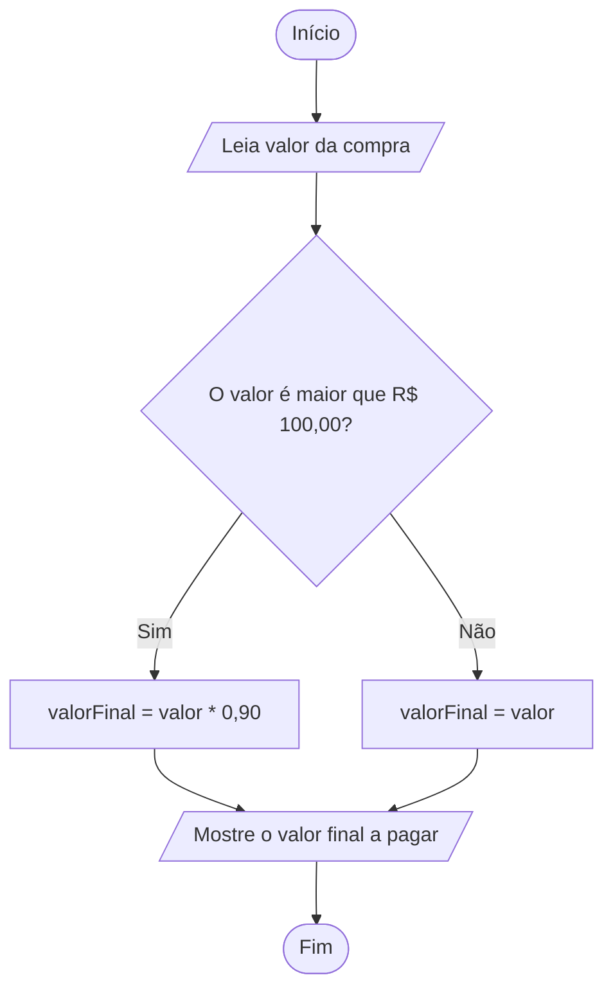

# Fluxograma

## Fluxograma em texto

Inicio:

Leia valor da compra

O valor é maior que R$ 100,00?

    Sim:
    Calcule o desconto:
    valorFinal = valor * 0,90 (10% de desconto)

    Não:
    Valor Final = valor

Montre o calor final a pagar

Fim

## Fluxograma em Mermaid

